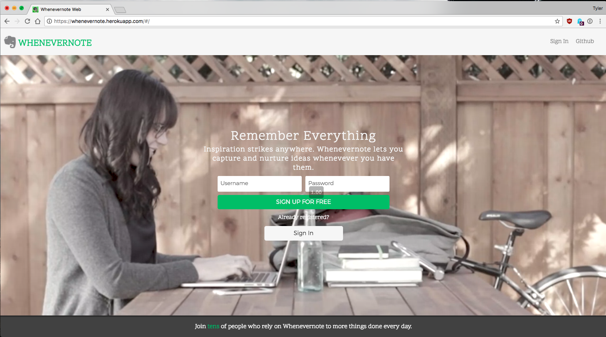
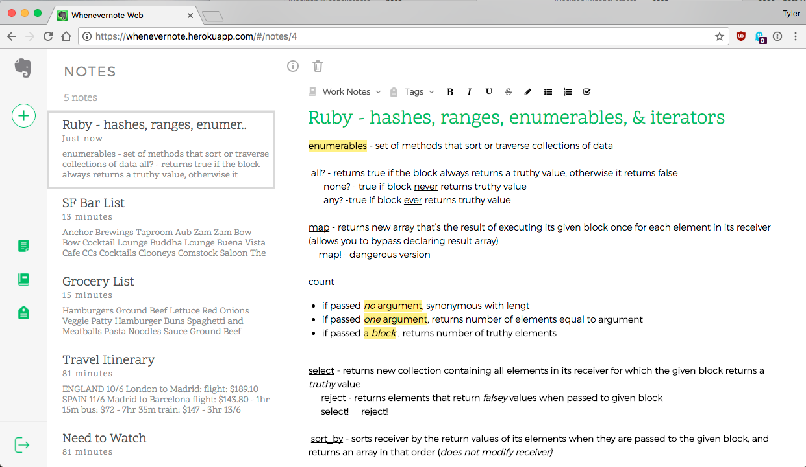
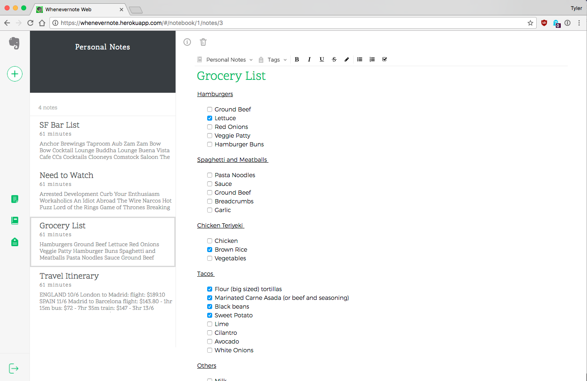

[Whenevernote Live](https://whenevernote.herokuapp.com)

## Whenevernote

Whenevernote is a full-stack web application inspired by Evernote built using Ruby on Rails and React/Redux with PostgreSQL. Whenevernote allows users to take notes, create to-do lists, and quickly write down their thoughts. These notes can be tagged and stored in notebooks for quick lookup whenever needed.

Splash Page with Session Form component and Webm video background

### Features
- User accounts with secure authentication
- Create, edit, and delete an unlimited number of notes within your virtual notebook
- Personalize notes by adding lists, checkboxes, highlighting and using code blocks
- Organize notes by placing them into personal notebooks
- Categorize notes by tagging them with multiple tags
- View all notes in a notebook and all notes with a certain tag
- Notes are auto-saved upon edits so users have less to worry about

### Project Design

Whenevernote was designed and built over the course of two weeks. A [proposal](./docs/README.md) was drafted to help form a timeline and guide through the app's development. The proposal included [wireframes](./docs/wireframes) for all views, a front-end [sample state](./docs/sample_state.md), and [database schema](./docs/schema.md).

### Technology

#### Backend

Whenevernote was built using Ruby on Rails and is hosted on Heroku. The different rails controllers send back the proper JSON responses depending on which API route was hit. PostgreSQL is used to manage the database locally and remotely.

##### Dependencies

- BCrypt for password salting and hashing to ensure user data remains secure and that plain text passwords are never stored.
- The splash page video and images in the app are hosted through Amazon Web Services and Cloudinary to ensure a fast and seamless user experience.

Rich Text Editing in the Note Detail view

#### Frontend

Whenevernote's frontend was built using the React framework and Flux/Redux cycle. These design choices were made so there would be an unidirectional data flow and all necessary data is stored in one source.

- Node package manager (npm) was used to install and save frontend dependencies.
- jQuery is used to make AJAX requests to the backend Rails API.
- Webpack was used to bundle all the reqeuired JavaScript files and ensure they are loaded in the correct order.
- Draft.js is used in the notes editing component allowing rich text features.
- Other frontend dependencies are React-DOM, React Router, Provider, React Mixin, and Babel for transpiling JSX into JavaScript for the browser.

Notebook view page lists all notes contained in selected notebook

#### Future Implementations

I would like to return to development of Whenevernote soon and more features including:

- Searching of notes, notebooks, and tags
- Multiple user sessions
- Add reminders to notes
