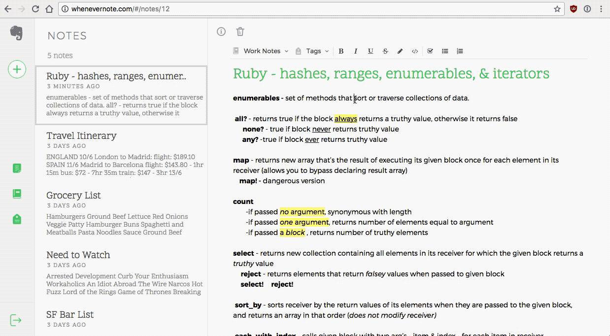

# Whenevernote

## [Whenevernote Live](https://whenevernote.herokuapp.com)

Whenevernote is a full-stack web application inspired by Evernote built using Ruby on Rails and React/Redux with PostgreSQL. Whenevernote allows users to take notes, create to-do lists, and quickly write down their thoughts. These notes can be tagged and stored in notebooks for quick lookup whenever needed.


Splash Page with Session Form component and Webm video background

## Features
- User accounts with secure authentication
- Create, edit, and delete an unlimited number of notes within your virtual notebook
- Personalize notes by adding lists, checkboxes, highlighting and using code blocks
- Organize notes by placing them into personal notebooks
- Categorize notes by tagging them with multiple tags
- View all notes in a notebook and all notes with a certain tag
- Notes are auto-saved upon edits so users have less to worry about

## Project Design

Whenevernote was designed and built over the course of two weeks. A [proposal](./docs/README.md) was drafted to help form a timeline and guide through the app's development. The proposal included [wireframes](./docs/wireframes) for all views, a front-end [sample state](./docs/sample_state.md), and [database schema](./docs/schema.md). Project follows airbnb's JavaScript and React style guides to ensure clean and maintainable code.

## Technology

### Backend

Whenevernote was built using Ruby on Rails and is hosted on Heroku. The different rails controllers send back the proper JSON responses depending on which API route was hit. PostgreSQL is used to manage the database locally and remotely.

#### Dependencies

- BCrypt for password salting and hashing to ensure user data remains secure and that plain text passwords are never stored.
- The splash page video and images in the app are hosted through Amazon Web Services and Cloudinary to ensure a seamless and scalable user experience.
- CSRF prevention by including a verification token in all forms protecting users from malicious attacks


Password hashing and user authentication inside of the User model. Password input from the user validated to be at least 8 characters requiring a strong password from the user. User's password is then salted and hashed with 128-bit encryption before being commited to database and plain text passwords never stored.

Sign in form allows for user authentication using either username or email input. Database is then queried for each parameter and verifies the user after unsalting the password digest stored in database.

```ruby
# User model
validates :password, length: { minimum: 8, allow_nil: true }

def password=(password)
  @password = password
  self.password_digest = BCrypt::Password.create(password)
end

def is_password?(password)
  BCrypt::Password.new(self.password_digest).is_password?(password)
end

def self.find_by_credentials(user_sign_in, password)
  @user = User.find_by(username: user_sign_in)
  @user = User.find_by(email: user_sign_in) if @user.nil?
  return @user if @user && @user.is_password?(password)
  nil
end
```

### Frontend

Whenevernote's frontend was built using the React framework and Redux cycle. These design choices were made so there would be an unidirectional data flow and all necessary data is stored in one source.

#### Dependencies

- Node package manager (npm) was used to install and save frontend dependencies.
- jQuery is used to make AJAX requests to the backend Rails API.
- Webpack was used to bundle all the reqeuired JavaScript files and ensure they are loaded in the correct order.
- Draft.js is used in the notes editing component allowing rich text features.
- Other frontend dependencies are React-DOM, React Router, Provider, React Mixin, and Babel for transpiling JSX into JavaScript for the browser.

After the Notes index component mounts it fetches all notes belonging to the currently signed in user, achieved using associations in the Rails back end. Notes are sorted by last updated time using a selector before being returned to the component. Notes index will asynchronously wait for the return of successful promise then load the most recent note into the detail view.



Rich Text Editing in the Note Detail view


```javascript
// Sorting of notes into most recently updated
export const notesByUpdated = ({ notes }) => {
  const allNotes = values(notes);
  return allNotes.sort((a, b) => (new Date(b.updated_at) - new Date(a.updated_at)));
};

// Notes Index fetches notes then loads the most recent
componentDidMount() {
  this.props.fetchNotes().then(() => {
    this.props.history.push(`/notes/${this.props.notes[0].id}`);
  });
}
```
Session form designed to be used for both signing in and signing up for site. Process form method determined by current route inside the component containter then called when submit button is clicked.

```javascript
const mapDispatchToProps = (dispatch, ownProps) => {
  const formType = ownProps.location.pathname;
  const processForm = (formType === '/signup/') ? signup : signin;
  return {
    processForm: user => dispatch(processForm(user)),
    clearErrors: () => dispatch(clearErrors()),
  };
};
```

Notebook Index component designed for use in multiple locations in the application. When in the sidebar modal, the click will cause a redirect to show all notes within selected notebook. Clicking an index item inside of the Note detail page will move the current note into the selected notebook.

The component when created is assigned a callback 'type' passed down as a prop to each index item. This callback type determines the action performed when a user clicks on the element. Notes count is a boolean setting whether or not to display note count in index view.

```javascript
// Notebook Index created in Note detail toolbar
<NotebooksIndex
  note={this.props.note}
  updateNote={this.props.updateNote}
  iiCallback={'assign'}
  notesCount={false}
/>

// Callback action called upon click either redirecting or updating of note
callbackAction() {
  if (this.props.iiCallback === 'link') {
    this.props.history.push(`/notebook/${this.props.notebook.id}/notes`);
  } else if (this.props.iiCallback === 'assign') {
    const newNotebook = { notebook_id : this.props.notebook.id };
    const updatedNote = merge({}, this.props.note, newNotebook);

    this.props.updateNote(updatedNote);
  }
}

render() {
  const { title } = this.props.notebook;

  return (
    <li onClick={this.callbackAction} className="notebooks-ii">
      <h4 className="nb-ii-child">{title}</h4>
      {this.notesCount()}
    </li>
  );
}
```

NoteDetail component mounts then loads note to display based off the current route and sets an interval that calls the auto save method. Auto save checks the current note for any changes made by user to the title or body before sending PATCH request to save note, preventing the constant firing off of API requests.

```javascript
componentDidMount() {
  this.props.fetchSingleNote(this.props.match.params.noteId).then(() => {
    this.props.fetchSingleNotebook(this.props.note.notebook_id);
    this.convertFromDB(this.props.note);
  });

  this.setInterval(() => {
    this.autoSave();
  }, 5000);
}

autoSave() {
  const noteBody = convertToRaw(this.state.editorState.getCurrentContent());
  const body = JSON.stringify(noteBody);

  if ((this.state.title !== this.props.note.title) || (body !== this.props.note.body)) {
    const note = {
      body,
      id: this.state.id,
      title: this.state.title,
      notebook_id: this.state.notebook_id,
    };
    this.props.updateNote(note);
  }
}
```


Notebook creation and note filing

### Future Implementations

I would like to return to development of Whenevernote when time permits and implement more features including:

- Searching of notes, notebooks, and tags
- Multiple user sessions
- Add reminders and shortcuts to notes
